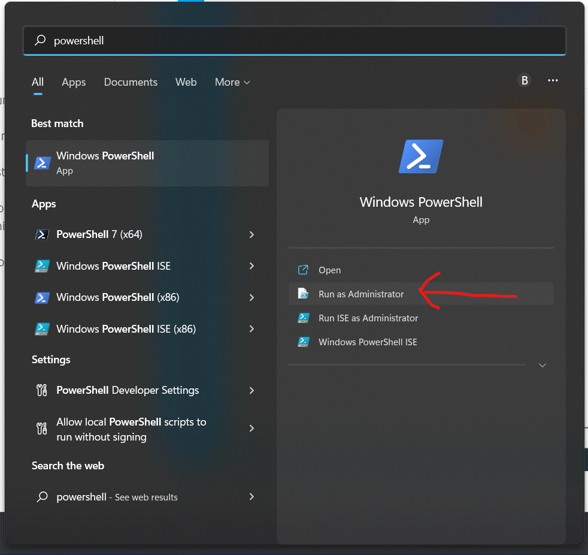
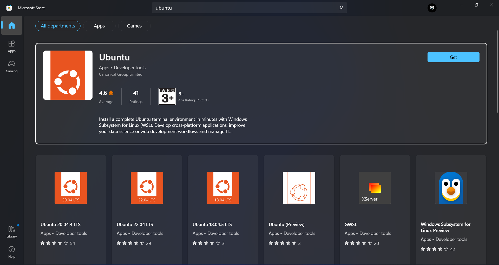
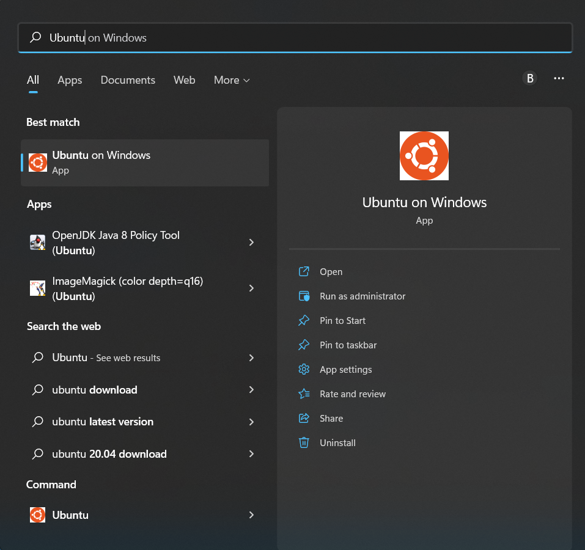
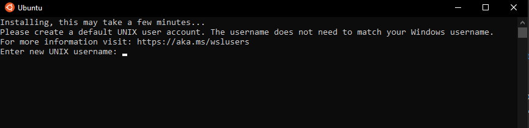

# Setup a Python Dev Environment on Windows Subsystem for Linux (WSL2)

This is a quick guide to setup Python (Anaconda) on WSL2 with Ubuntu on a Windows machine. The steps are basically a central collection of various tutorials centralized in one place as a quick cheat sheet.

## Pre-Requisites

You must be running Windows 10 version 2004 and higher (Build 19041 and higher) or Windows 11. If you're running an older build, see [WSL manual installation steps for older versions](https://docs.microsoft.com/en-gb/windows/wsl/install-manual).

To check your Windows version and build number, press **Windows logo key + R**, type **winver**, select **OK**. You can update to the latest Windows version by selecting Start > Settings > Windows Update

## Install WSL 2 and Ubuntu

1. Open powershell as administrator

    

2. Run the following command:
    ```
    wsl.exe --install
    ```
    This will automatically do all of the setup required and installs WSL 2 by default.

2. Restart your computer

3. Open the Microsoft Store and search for **Ubuntu**. This will show you a lot of versions, install the latest one like **Ubuntu 22.04 LTS**.
    
    

4. Once the process of installing Ubuntu with WSL is complete, open **Ubuntu** using the **Start menu**. For the first time it will take a bit time, but all future launches should be quick.

    

5. Once it has finished its initial setup, you will need to create a username and password (this does not need to match your Windows user credentials)

    

6. Finally, its best to update the packages in ubuntu by running
    ```bash
    sudo apt update
    ```
    Then,
    ```bash
    sudo apt full-upgrade
    ```
    Press **Y** when prompted.

## Install Python using Anaconda

1. Open Ubuntu terminal from the Start menu

2. Run the following command to download the Anaconda setup file for linux
    ```bash
    wget https://repo.anaconda.com/archive/Anaconda3-2022.05-Linux-x86_64.sh
    ```

3. Install Anaconda
    ```bash
    bash Anaconda3-2022.05-Linux-x86_64.sh
    ```

4. You will asked to agree to the terms of service (press **Enter** to scroll past the terms). Type **yes** when prompted to accept them.

5. The setup will continue and once its installed, close the terminal window and open the Ubuntu terminal from the Start again.

6. Now you should see `base` written beside your typing space in the terminal which indicates you are in the base environment.

    
